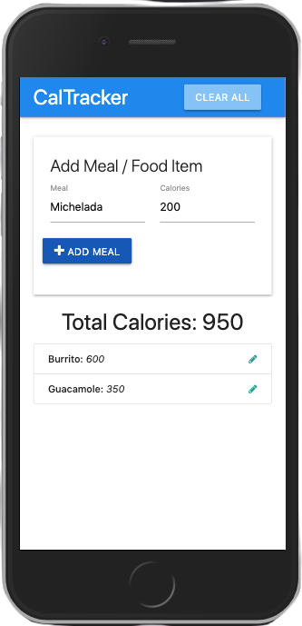
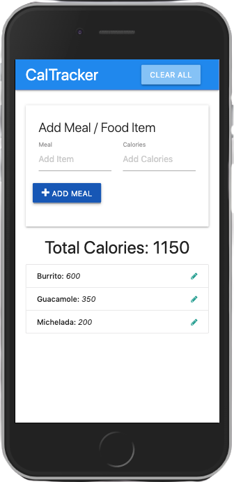
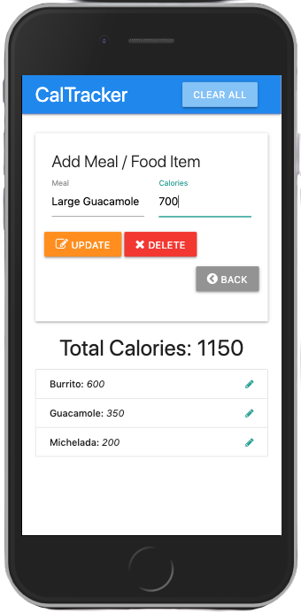
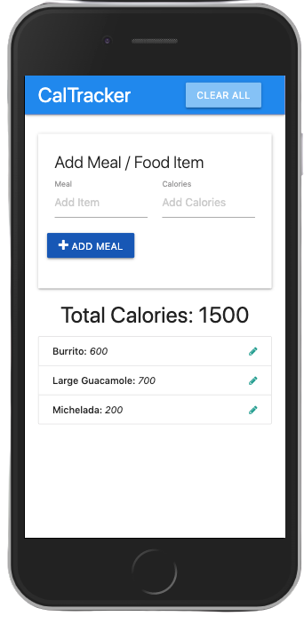
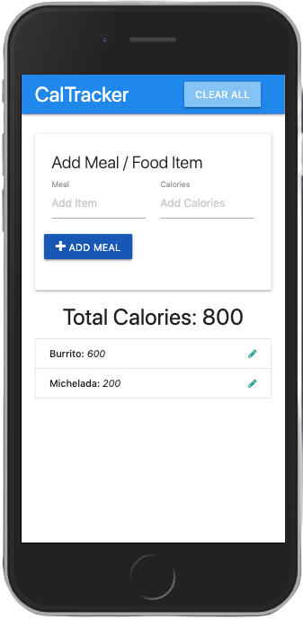
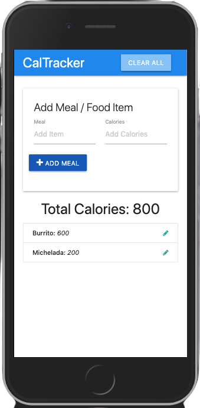
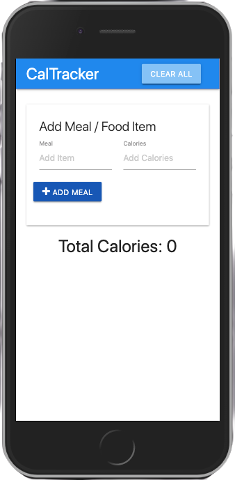

# CalTracker

#### _April 2020_

#### By _**Marc Davies**_

# Table of Contents

<!--ts-->

- [Description](#description)
- [Technologies Used](#technologies-used)
- [Setup and Installation](#setup-and-installation)
- [Known Bugs](#known-bugs)
- [Support And Contact Details](#support-and-contact-details)
<!--te-->

## Description

Application which allows user to track meals and calories. This application showcases Vanilla Javascript, working with the DOM and localStorage.

## Technologies Used

- _HTML 5_
- _Materialize CSS_
- _Javascript_
- _jQuery 3.5.1_ _(for Materialize)_

## Setup and Installation

- Launch your terminal.
- `cd desktop` Navigate to the desktop.
- `git clone "https://github.com/MarcLignarius/JS.CalTracker"` Clone this repository to your desktop.
- `cd JS.CalTracker` Open up the cloned repository.
- `open index.html` to open the application in your browser.

Alternatively, visit https://marclignarius.github.io/JS.CalTracker/ to see the live version of the application.

## User Stories

### Adding A Meal

|        Adding A Meal         |          Meal Added          |
| :--------------------------: | :--------------------------: |
|  |  |

### Editing A Meal

|        Editing a Meal        |         Meal Edited          |
| :--------------------------: | :--------------------------: |
|  |  |

### Deleting A Meal

|       Deleting A Meal        |         Meal Deleted         |
| :--------------------------: | :--------------------------: |
|  |  |

### Clearing All Meals

|      Deleting All Meals      |      All Meals Deleted       |
| :--------------------------: | :--------------------------: |
|  |  |

## Known Bugs

There are no known bugs as of that last release.

## Support and Contact Details

Please contact me via <a href="https://www.linkedin.com/in/marcdaviesriot/">LinkedIn</a> if you have any questions. Your feedback is always welcomed!

Copyright (c) 2020 **_Marc Davies_**
